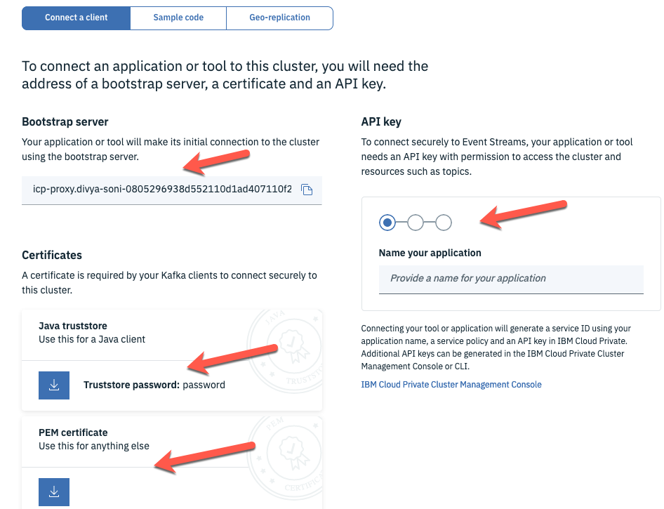
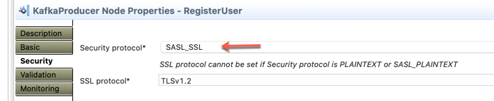

# Connecting App Connect Enterprise with Event Streams  

### Introduction
The instructions below will outline the steps to connect ACE flow with event streams.   

### Prerequisites
* This article assumes you have working knowledge of Cloud Pak for integration, ACE toolkit and Event Streams. 
* You have an existing ACE Flow that uses a Kafka Consumer or producer node
* You have an existing CP4I environment with Event Streams running

### The instructions here are broken down in four parts
* Event Streams configuration 
* Message Flow configuration in the ACE toolkit
* Prepare App Connect Enterprise parameters to connect to Event Streams
* Deploy BAR file on ACE server

### Event Streams Configuration
* Go to your event streams environment, and get the following information:  
		Topic Name (Where you want to publish events to)
		
  		
    
  	
	- Copy the bootstrap server address. 
	- Create an API Key by going through the steps under API Key  
	- Download the PEM certificate 
	- Remember the password for the truststore: password. 
 	

### ACE toolkit message flow configuration 
* Go to your ACE message flow where you are using KAFKA node. In this example, I am using a Kafka Publisher node. Under Basic, give your Topic name; Bootstrap servers. 


* Go to security Tab, and under the security protocol drop down select "SASL_SSL".



* Follow the standard process of creating a new bar file.

### Prepare App Connect Enterprise parameters to connect to Event Streams
* Download the config directory from this repo to your local filesystem.  
 We will work with the following files:  
	```serverconf.yaml```   
	```setdbparms.txt```     
	```truststoreCert-mykey.crt```  
	```truststorePassword.txt```    
* Go to your desktop and untar the config directory to a location of your choice and then change directory into that location. In the next few steps, we will edit some of these files. 

* Open the previously downloaded **es-api-key.json** and copy the api key between **" "**. Edit **setdbparms.yaml** file to include the API key right after token like this. (You need to copy the Event Streams API Key here.) :  

		
* Next you will use the PEM certificate **es-cert.pem** that you previously downloaded. In your terminal window copy the **es-cert.pem** to the config directory. Copy it as **truststoreCert-mykey.crt**. This is the cert name **generatesecrets.sh** looks for when executed.

* Log into your openshift environment with CLI. You can copy the login command from the Openshift console in the top right corner under your ID. 

* Once logged in, type ```oc project ace``` 
* In the config directory, edit **truststorePassword.txt** and add the password in the file. In our case, password is **password**.

* Your **config** directory should look like this. The arrow points to all the files that will be used to generate the secret. 


* From the config directory, execute **./generateSecrets.sh my-secret**

* To verify that your secret was created, go to the openshift console and verify that your secret looks like this:
Go to your openshift console --> ACE Namespace --> Resources --> Secrets --> my-secret.  
   
  


### Deploy App Connect BAR file on App Connect Enterprise Server
* Go into Cloud Pak for Integration and deploy a new server using your BAR file.
* Fill in all the details as you normally would. 
* Scroll down, locate **Integration Server** configuration. Type **mykey** into **List of Certificate aliases for the truststore**, you created as **truststoreCert-mykey.crt**. 
* Enter the name of the secret: **my-secret**
* Select **Install**

### Test
* Once the install is successful, test your flow and you should see an event in a topic in Event Streams. 
